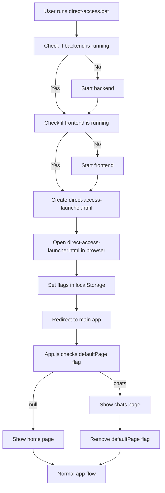

# Design Document

## Overview

מסמך זה מתאר את התכנון לשינוי התנהגות האפליקציה כך שתיפתח ישירות בדף הצ'אט כאשר המשתמש מפעיל את direct-access.bat. הפתרון יהיה פשוט, יציב וקל לתחזוקה.

## Architecture

הפתרון יתבסס על שני חלקים עיקריים:

1. **שינוי בקובץ direct-access.bat** - הקובץ יגדיר דגל ב-localStorage שיציין שהאפליקציה צריכה להיפתח בדף הצ'אט.
2. **שינוי בקובץ App.js** - הקובץ יבדוק את הדגל ב-localStorage ויציג את דף הצ'אט במקום דף הבית אם הדגל קיים.

## Components and Interfaces

### direct-access.bat

הקובץ direct-access.bat יבצע את הפעולות הבאות:

1. יבדוק אם השרת האחורי (backend) פועל, ואם לא - יפעיל אותו.
2. יבדוק אם השרת הקדמי (frontend) פועל, ואם לא - יפעיל אותו.
3. ייצור קובץ HTML זמני (direct-access-launcher.html) שיגדיר את הדגלים הבאים ב-localStorage:
   - `directAccessUser` - משתמש מזויף לגישה ישירה
   - `db_provider` - ספק מסד הנתונים (Firebase)
   - `isDirectAccessMode` - דגל שמציין שאנחנו במצב גישה ישירה
   - `defaultPage` - דגל שמציין שהאפליקציה צריכה להיפתח בדף הצ'אט
4. יפתח את הקובץ HTML הזמני בדפדפן.

### App.js

הקובץ App.js יבצע את הפעולות הבאות:

1. יבדוק את הדגל `defaultPage` ב-localStorage בעת טעינת האפליקציה.
2. אם הדגל קיים ושווה ל-"chats", יציג את דף הצ'אט במקום דף הבית.
3. ימחק את הדגל מ-localStorage כדי שלא ישפיע על טעינות עתידיות של האפליקציה.

## Data Models

לא נדרשים מודלי נתונים חדשים לפתרון זה. אנו משתמשים ב-localStorage הקיים לאחסון הדגלים.

## Error Handling

1. אם הדגל `defaultPage` לא קיים ב-localStorage, האפליקציה תיפתח בדף הבית כרגיל.
2. אם יש שגיאה בעת קריאת הדגל מ-localStorage, האפליקציה תיפתח בדף הבית כרגיל.
3. אם יש שגיאה בעת הצגת דף הצ'אט, האפליקציה תציג את דף הבית כרגיל.

## Testing Strategy

1. **בדיקת הפעלה רגילה** - לוודא שהאפליקציה נפתחת בדף הבית כאשר המשתמש מפעיל אותה באופן רגיל.
2. **בדיקת הפעלה עם direct-access.bat** - לוודא שהאפליקציה נפתחת בדף הצ'אט כאשר המשתמש מפעיל את direct-access.bat.
3. **בדיקת ניווט** - לוודא שהתפריט הצדדי עדיין עובד כראוי ושהמשתמש יכול לנווט בין הדפים השונים.
4. **בדיקת זיכרון מצב** - לוודא שהאפליקציה זוכרת את המצב האחרון בין הפעלות רגילות, אך מתעלמת ממנו כאשר המשתמש מפעיל את direct-access.bat.

## Implementation Considerations

1. **שינויים מינימליים** - הפתרון יכלול שינויים מינימליים בקוד הקיים כדי למנוע השפעה על פונקציונליות אחרת.
2. **תיעוד** - השינויים יתועדו היטב בקוד כדי להקל על תחזוקה עתידית.
3. **תאימות לדפדפנים** - הפתרון יעבוד בכל הדפדפנים המודרניים שתומכים ב-localStorage.
4. **ביצועים** - הפתרון לא ישפיע על ביצועי האפליקציה, כיוון שהוא מבצע בדיקה פשוטה בעת טעינת האפליקציה.

## Diagrams

### Flow Diagram

